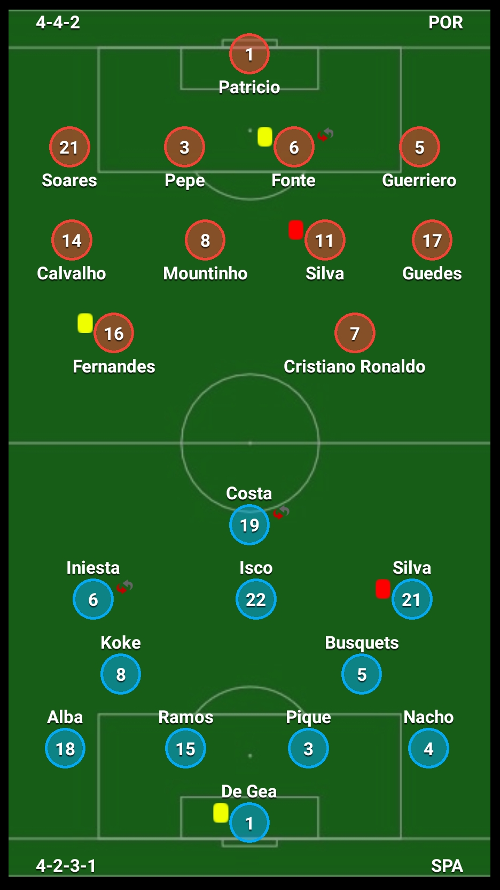

# React Native: Football Lineup

[](https://www.npmjs.com/package/react-native-football-lineup)
[](https://github.com/gaetanozappi/react-native-football-lineup)
[](https://github.com/gaetanozappi/react-native-football-lineup/issues)



-   [Usage](#usage)
-   [License](#license)

## Usage

```javascript
import React, { Component } from 'react';
import { View, StyleSheet } from 'react-native';
import FootballField from './FootballField';

var home = {
  name: 'POR',
  module: '4-4-2',
  team: [
    [
      {
        number: 1,
        name: 'Patricio',
      },
    ],
    [
      {
        number: 21,
        name: 'Soares',
      },
      {
        number: 3,
        name: 'Pepe',
      },
      {
        number: 6,
        name: 'Fonte',
      },
      {
        number: 5,
        name: 'Guerriero',
      },
    ],
    [
      {
        number: 14,
        name: 'Calvalho',
      },
      {
        number: 8,
        name: 'Mountinho',
      },
      {
        number: 11,
        name: 'Silva',
      },
      {
        number: 17,
        name: 'Guedes',
      },
    ],
    [
      {
        number: 16,
        name: 'Fernandes',
      },
      {
        number: 7,
        name: 'Cristiano Ronaldo',
      },
    ],
  ],
  home_team_events: [
    {
      id: 203,
      type_of_event: 'red-card',
      player: 'Silva',
      time: "3'",
    },
    {
      id: 210,
      type_of_event: 'yellow-card',
      player: 'Fernandes',
      time: "64'",
    },
    {
      id: 210,
      type_of_event: 'yellow-card',
      player: 'Fonte',
      time: "64'",
    },
    {
      id: 206,
      type_of_event: 'substitution-in',
      player: 'Fonte',
      time: "31'",
    },
  ],
};

var away = {
  name: 'SPA',
  module: '4-2-3-1',
  team: [
    [
      {
        number: 1,
        name: 'De Gea',
      },
    ],
    [
      {
        number: 18,
        name: 'Alba',
      },
      {
        number: 15,
        name: 'Ramos',
      },
      {
        number: 3,
        name: 'Pique',
      },
      {
        number: 4,
        name: 'Nacho',
      },
    ],
    [
      {
        number: 8,
        name: 'Koke',
      },
      {
        number: 5,
        name: 'Busquets',
      },
    ],
    [
      {
        number: 6,
        name: 'Iniesta',
      },
      {
        number: 22,
        name: 'Isco',
      },
      {
        number: 21,
        name: 'Silva',
      },
    ],
    [
      {
        number: 19,
        name: 'Costa',
      },
    ],
  ],
  away_team_events: [
    {
      id: 210,
      type_of_event: 'yellow-card',
      player: 'De Gea',
      time: "12'",
    },
    {
      id: 206,
      type_of_event: 'substitution-in',
      player: 'Iniesta',
      time: "31'",
    },
    {
      id: 206,
      type_of_event: 'substitution-in',
      player: 'Costa',
      time: "32'",
    },
    {
      id: 206,
      type_of_event: 'red-card',
      player: 'Silva',
      time: "31'",
    },
  ],
};

export default class App extends Component {
  render() {
    return (
      <View style={styles.container}>
        <FootballField home={home} away={away} />
      </View>
    );
  }
}

const styles = StyleSheet.create({
  container: {
    flex: 1,
    padding: 35,
    borderColor: '#fff',
    backgroundColor: '#000',
  },
});

```

## License
This library is provided under the Apache License.
